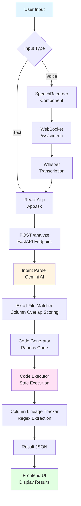

# Excel AI Agent

An intelligent data analysis agent that uses AI to understand natural language questions about Excel files and automatically generates, executes, and returns analysis results. The system supports both text and voice input, making data analysis accessible to non-technical users.

## Project Overview

The Excel AI Agent is a full-stack web application that bridges the gap between natural language questions and data analysis. Users can upload Excel files, ask questions in plain English (or speak them), and receive instant analysis results with generated Python code, execution results, and column lineage tracking.

**Key Features:**
- 📊 **Natural Language Processing**: Ask questions in plain English about your Excel data
- 🎤 **Voice Input**: Speak your questions using real-time speech-to-text transcription
- 🤖 **AI-Powered Intent Parsing**: Uses Google Gemini AI to understand user intent
- 🐍 **Automatic Code Generation**: Generates Python pandas code based on parsed intent
- ⚡ **Live Code Execution**: Safely executes generated code and returns results
- 📋 **Column Lineage Tracking**: Automatically tracks which columns are used in analysis
- 📁 **Multi-File Support**: Automatically matches queries to the most relevant Excel file
- 🔄 **Excel Preprocessing**: Handles complex headers, merged cells, and data cleaning

## System Architecture

```
┌─────────────────┐
│   Frontend      │
│  React + TS     │
│  (Port 5173)    │
└────────┬────────┘
         │ HTTP/WebSocket
         │
┌────────▼─────────────────────────────────────┐
│           Backend (FastAPI)                  │
│           (Port 8000)                        │
│                                              │
│  ┌──────────────────────────────────────┐   │
│  │  API Endpoints                       │   │
│  │  - /upload_excel                     │   │
│  │  - /analyze                          │   │
│  │  - /ws/speech (WebSocket)            │   │
│  └──────────────────────────────────────┘   │
│                                              │
│  ┌──────────────────────────────────────┐   │
│  │  Core Pipeline                       │   │
│  │  1. Intent Parser (Gemini AI)        │   │
│  │  2. File Matcher                     │   │
│  │  3. Code Generator                   │   │
│  │  4. Code Runner                      │   │
│  │  5. Column Lineage Extractor         │   │
│  └──────────────────────────────────────┘   │
│                                              │
│  ┌──────────────────────────────────────┐   │
│  │  Supporting Services                 │   │
│  │  - Excel Preprocessor                │   │
│  │  - File Indexer                      │   │
│  │  - Speech Transcriber (Whisper)      │   │
│  └──────────────────────────────────────┘   │
└──────────────────────────────────────────────┘
         │
         │ File System
         │
┌────────▼────────┐
│   data/         │
│   - *.xlsx      │
│   - index.json  │
└─────────────────┘
```

### Data Flow

The complete analysis pipeline flow:

#### Visual Flow Diagram (Mermaid)



#### Text Flow Diagram (ASCII)

```
┌─────────────────────────────────────────────────────────────┐
│                        User Input                           │
│                    (Text / Voice)                           │
└───────────────┬───────────────────────┬─────────────────────┘
                │                       │
        ┌───────▼───────┐       ┌───────▼────────┐
        │   Text Input  │       │  Voice Input   │
        └───────┬───────┘       └───────┬────────┘
                │                       │
                │              ┌────────▼────────┐
                │              │ SpeechRecorder  │
                │              │   Component     │
                │              └────────┬────────┘
                │                       │
                │              ┌────────▼────────┐
                │              │   WebSocket     │
                │              │  /ws/speech     │
                │              └────────┬────────┘
                │                       │
                │              ┌────────▼────────┐
                │              │    Whisper      │
                │              │ Transcription   │
                │              └────────┬────────┘
                │                       │
                └───────────┬───────────┘
                            │
                    ┌───────▼────────┐
                    │  React App     │
                    │  (App.tsx)     │
                    └───────┬────────┘
                            │
                    ┌───────▼──────────────┐
                    │  POST /analyze       │
                    │  FastAPI Endpoint    │
                    └───────┬──────────────┘
                            │
                    ┌───────▼──────────────┐
                    │  Intent Parser       │
                    │  (Gemini AI)         │
                    └───────┬──────────────┘
                            │
                    ┌───────▼──────────────┐
                    │  Excel File Matcher  │
                    │  (Column Overlap)    │
                    └───────┬──────────────┘
                            │
                    ┌───────▼──────────────┐
                    │  Code Generator      │
                    │  (Pandas Code)       │
                    └───────┬──────────────┘
                            │
                    ┌───────▼──────────────┐
                    │  Code Executor       │
                    │  (Safe Execution)    │
                    └───────┬──────────────┘
                            │
                    ┌───────▼──────────────┐
                    │  Column Lineage      │
                    │  Tracker (Regex)     │
                    └───────┬──────────────┘
                            │
                    ┌───────▼──────────────┐
                    │  Result JSON         │
                    └───────┬──────────────┘
                            │
                    ┌───────▼──────────────┐
                    │  Frontend UI         │
                    │  (Display Results)   │
                    └──────────────────────┘
```

### Workflow

1. **Upload**: User uploads Excel file → Preprocessed and indexed
2. **Query**: User asks question (text or voice) → Transcribed if voice
3. **Parse**: Question → Gemini AI parses intent (analysis_type, metric, group_by, etc.)
4. **Match**: Intent → System matches to best Excel file based on column overlap
5. **Generate**: Intent + File → Python pandas code generated
6. **Execute**: Code → Safely executed in restricted environment
7. **Extract**: Code → Column lineage extracted via regex
8. **Return**: Results → JSON response with code, results, columns, lineage

## Tech Stack

### Backend
- **FastAPI** - Modern Python web framework with async support
- **Google Gemini AI** (`gemini-2.0-flash`) - Natural language understanding for intent parsing
- **OpenAI Whisper** - Speech-to-text transcription for voice input
- **Pandas** - Data manipulation and analysis
- **OpenPyXL** - Excel file reading and preprocessing
- **WebSockets** - Real-time bidirectional communication for voice input
- **Python 3.8+** - Core runtime

### Frontend
- **React 18** - UI library
- **TypeScript** - Type-safe JavaScript
- **Vite** - Fast build tool and dev server
- **WebSocket API** - Real-time audio streaming
- **Web Audio API** - Microphone access and audio processing

### Development Tools
- **pytest** - Backend testing
- **Vitest** - Frontend testing
- **ESLint** - Code linting

## How to Run Backend

### Prerequisites
- Python 3.8 or higher
- pip (Python package manager)

### Installation

1. **Navigate to the backend directory:**
   ```bash
   cd backend
   ```

2. **Create a virtual environment (recommended):**
   ```bash
   python -m venv venv
   source venv/bin/activate  # On Windows: venv\Scripts\activate
   ```

3. **Install dependencies:**
   ```bash
   pip install -r requirements.txt
   ```

4. **Set up environment variables:**
   
   Create a `.env` file in the `backend` directory:
   ```bash
   GOOGLE_GEMINI_API_KEY=your_gemini_api_key_here
   ```
   
   To get a Gemini API key:
   - Visit [Google AI Studio](https://makersuite.google.com/app/apikey)
   - Create a new API key
   - Copy it to your `.env` file

### Running the Backend

Start the FastAPI server:
```bash
uvicorn main:app --reload
```

The backend will be available at `http://localhost:8000`

- **API documentation**: `http://localhost:8000/docs` (Swagger UI)
- **Alternative docs**: `http://localhost:8000/redoc` (ReDoc)
- **Health endpoint**: `http://localhost:8000/health`

### Backend API Endpoints

- `POST /upload_excel` - Upload and index an Excel file
- `POST /analyze` - Complete analysis workflow (parse → generate → execute)
- `POST /analyze/plan` - Parse intent and match file (no code generation)
- `POST /analyze/code` - Parse intent, match file, and generate code
- `POST /analyze/execute` - Execute provided Python code
- `GET /health` - Health check endpoint
- `WebSocket /ws/speech` - Real-time speech-to-text and analysis

## How to Run Frontend

### Prerequisites
- Node.js 18 or higher
- npm or yarn

### Installation

1. **Navigate to the frontend directory:**
   ```bash
   cd frontend
   ```

2. **Install dependencies:**
   ```bash
   npm install
   ```

### Running the Frontend

Start the development server:
```bash
npm run dev
```

The frontend will be available at `http://localhost:5173`

The app will automatically connect to the backend at `http://localhost:8000`.

### Frontend Scripts

- `npm run dev` - Start development server
- `npm run build` - Build for production
- `npm run preview` - Preview production build
- `npm test` - Run tests
- `npm run lint` - Lint code

## Development Workflow

1. **Start the backend server** (in one terminal):
   ```bash
   cd backend
   source venv/bin/activate  # if using venv
   uvicorn main:app --reload
   ```

2. **Start the frontend development server** (in another terminal):
   ```bash
   cd frontend
   npm run dev
   ```

3. **Open your browser** to `http://localhost:5173` to see the application.

Both backend and frontend support hot reload during development.

## Example Query

### Perfect Demo Questions

We've prepared **3 perfect demo questions** that have been tested and verified to work correctly:

1. **Aggregation**: `"Show total sales by region"`
2. **Trend**: `"Analyze monthly revenue trend"`
3. **Top N**: `"Show top 5 products by revenue"`

📋 **See [DEMO_QUESTIONS.md](DEMO_QUESTIONS.md) for detailed documentation of these demos.**

All demo questions:
- ✅ Return perfectly formatted tables
- ✅ Have no console errors
- ✅ Gemini correctly maps natural language to actual column names (no hallucination)
- ✅ Use the `cola.xlsx` dataset

### Text Input Example

**Question:**
```
Show total sales by region
```

**What happens:**
1. System parses intent: `analysis_type: "groupby"`, `metric: "total sales"`, `group_by: ["City"]`
   - Gemini correctly maps "region" → "City" column
2. Matches to file: `cola.xlsx` (score: 1.00, based on column overlap)
3. Generates code:
   ```python
   import pandas as pd
   from excel_preprocessor import preprocess_excel
   
   df = preprocess_excel('data/cola.xlsx')
   result = df.groupby(['City'])['total sales'].agg(['count', 'mean', 'sum']).reset_index()
   ```
4. Executes code and returns results with columns: `City`, `count`, `mean`, `sum`

### Voice Input Example

1. Click the microphone button
2. Speak: "Show top 5 products by revenue"
3. System transcribes audio using Whisper
4. Runs the same analysis pipeline as text input
5. Returns results with generated code and data

## Example Output

### Response Structure

```json
{
  "intent": {
    "analysis_type": "topn",
    "metric": "sales",
    "group_by": [],
    "time_field": null,
    "top_n": 10
  },
  "code": "import pandas as pd\nfrom excel_preprocessor import preprocess_excel\n\ndf = preprocess_excel('data/vip_products_clearance_2025.xlsx')\nresult = df.nlargest(10, 'sales')",
  "target_file": "vip_products_clearance_2025.xlsx",
  "used_columns": ["sales", "product_name", "price", "quantity"],
  "result_preview": [
    {
      "product_name": "Product A",
      "sales": 50000,
      "price": 100,
      "quantity": 500
    },
    ...
  ],
  "columns": ["product_name", "sales", "price", "quantity"],
  "stdout": "",
  "error": null
}
```

### Frontend Display

The frontend displays:
- **Parsed Intent** - JSON structure showing how the question was interpreted
- **Generated Python Code** - The pandas code that was executed
- **Analysis Result** - Table view of the results (first 50 rows)
- **Used Columns** - Visual list of columns referenced in the analysis
- **Output/Errors** - Any print statements or error messages

## How Gemini Is Used

Google Gemini AI (`gemini-2.0-flash`) is used for **intent parsing** - converting natural language questions into structured analysis instructions.

### Process

1. **Prompt Construction**: The system builds a prompt that includes:
   - The user's question
   - All available column names from indexed Excel files
   - Instructions on how to structure the response

2. **Intent Parsing**: Gemini analyzes the question and returns a JSON object with:
   - `analysis_type`: One of `["sum", "avg", "trend", "groupby", "sort", "topn"]`
   - `metric`: The numeric column to aggregate (if applicable)
   - `group_by`: List of columns to group by (if applicable)
   - `time_field`: Time-related column for trend analysis (if applicable)
   - `top_n`: Number for top N queries (if applicable)

3. **Column Matching**: Gemini maps semantic names in the question to actual column names from the dataset (e.g., "sales amount" → "sales_amount")

### Example Gemini Interaction

**Input:**
```
Question: "What is the total revenue by region?"
Available columns: ["region", "revenue", "date", "product"]
```

**Gemini Output:**
```json
{
  "analysis_type": "sum",
  "metric": "revenue",
  "group_by": ["region"],
  "time_field": null,
  "top_n": null
}
```

This structured intent is then used to generate the appropriate pandas code.

## Column Lineage Explanation

**Column Lineage** tracks which columns from the original Excel file are actually used in the generated analysis code. This helps users understand:
- What data was analyzed
- Which columns influenced the results
- Data dependencies in the analysis

### How It Works

The system uses **regex pattern matching** to extract column references from the generated Python code:

1. **Pattern Matching**: Searches for patterns like:
   - `df["column_name"]`
   - `df['column_name']`
   - `variable["column_name"]`

2. **Extraction**: The `extract_used_columns()` function in `column_lineage.py`:
   ```python
   pattern = r'\w+\[["\']([^"\']+)["\']\]'
   matches = re.findall(pattern, code)
   ```

3. **Deduplication**: Removes duplicate column names while preserving order

4. **Display**: Shows the list of used columns in the frontend UI

### Example

**Generated Code:**
```python
df = preprocess_excel('data/sales.xlsx')
result = df.groupby(['region', 'category'])['revenue'].sum().reset_index()
result = result.sort_values('revenue', ascending=False)
```

**Extracted Columns:**
- `region`
- `category`
- `revenue`

These columns are displayed in the "Used Columns" section of the UI, giving users visibility into their data analysis lineage.

## Voice Input

Voice input is fully implemented using **OpenAI Whisper** for real-time speech-to-text transcription.

### How It Works

1. **Audio Capture**: Frontend uses Web Audio API to capture microphone input
   - Sample rate: 16kHz
   - Format: PCM, 16-bit
   - Chunked streaming to backend

2. **WebSocket Connection**: Real-time bidirectional communication
   - Endpoint: `ws://localhost:8000/ws/speech`
   - Binary messages: Audio chunks
   - JSON messages: Control signals (`{"type": "end"}`, `{"type": "reset"}`)

3. **Transcription**: Backend uses Whisper model
   - Model: `base` (configurable)
   - Real-time partial transcripts (every 1 second)
   - Final transcription after 2 seconds of silence or explicit end signal

4. **Analysis Pipeline**: Once transcription is complete:
   - Transcribed text is sent through the same analysis pipeline as text input
   - Results are returned via WebSocket

### Message Flow

**Client → Server:**
- Binary: Audio chunks (PCM bytes)
- JSON: `{"type": "end"}` - Signal end of speech
- JSON: `{"type": "reset"}` - Reset audio buffer

**Server → Client:**
- `{"type": "partial_transcript", "text": "..."}` - Real-time transcription
- `{"type": "final_transcript", "text": "..."}` - Final transcription
- `{"type": "status", "message": "Analyzing..."}` - Status updates
- `{"type": "analysis_result", "result": {...}}` - Complete analysis results
- `{"type": "error", "message": "..."}` - Error messages

### Setup

Whisper is automatically installed with `pip install -r requirements.txt`. The model is loaded on first use (lazy loading).

**Note**: First-time use will download the Whisper model (~150MB for `base` model), which may take a few minutes.

### Fallback Behavior

If Whisper is not available or fails to load:
- System falls back to placeholder transcription
- Error message is displayed to user
- Text input remains fully functional

## Project Structure

```
.
├── backend/
│   ├── main.py                 # FastAPI application and endpoints
│   ├── intent_parser.py        # Gemini AI intent parsing
│   ├── code_generator.py       # Python code generation
│   ├── code_runner.py          # Safe code execution
│   ├── column_lineage.py       # Column extraction from code
│   ├── excel_preprocessor.py   # Excel file preprocessing
│   ├── file_indexer.py         # File indexing and matching
│   ├── speech_transcriber.py   # Whisper speech-to-text
│   ├── requirements.txt        # Python dependencies
│   ├── pytest.ini             # Test configuration
│   ├── test_main.py           # Backend tests
│   ├── test_integration.py    # Integration tests
│   ├── data/                  # Excel files and index
│   │   ├── *.xlsx
│   │   └── index.json
│   └── venv/                  # Virtual environment (gitignored)
│
├── frontend/
│   ├── src/
│   │   ├── App.tsx            # Main application component
│   │   ├── main.tsx           # Entry point
│   │   ├── index.css          # Global styles
│   │   ├── components/
│   │   │   ├── CodeBlock.tsx      # Code display component
│   │   │   ├── ResultTable.tsx    # Results table component
│   │   │   ├── UsedColumns.tsx    # Column lineage display
│   │   │   └── SpeechRecorder.tsx # Voice input component
│   │   └── hooks/
│   │       └── useSpeechWebSocket.ts # WebSocket hook
│   ├── index.html
│   ├── package.json
│   ├── tsconfig.json
│   ├── vite.config.ts
│   └── vitest.config.ts
│
└── README.md                  # This file
```

## Testing

### Backend Tests

```bash
cd backend
pytest
```

### Frontend Tests

```bash
cd frontend
npm test
```

## Troubleshooting

### Backend Issues

**"GOOGLE_GEMINI_API_KEY not set"**
- Ensure you have a `.env` file in the `backend` directory
- Add `GOOGLE_GEMINI_API_KEY=your_key_here`

**"Whisper model not loading"**
- First run downloads the model (~150MB)
- Check internet connection
- Verify `openai-whisper` is installed: `pip install openai-whisper`

**"No matching file found"**
- Upload Excel files first via `/upload_excel` endpoint
- Check that files are in `backend/data/` directory
- Verify `index.json` exists and contains file mappings

### Frontend Issues

**"Cannot connect to backend"**
- Ensure backend is running on `http://localhost:8000`
- Check CORS settings in `main.py`
- Verify no firewall blocking the connection

**"Microphone not working"**
- Grant browser permissions for microphone access
- Use HTTPS in production (required for microphone API)
- Check browser console for WebSocket errors

## License

This project is provided as-is for educational and development purposes.

## Contributing

Contributions are welcome! Please ensure:
- Code follows existing style conventions
- Tests pass for new features
- Documentation is updated
- Backend and frontend remain compatible
